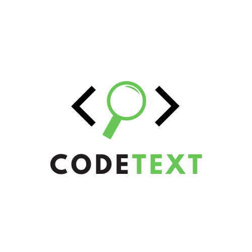

<div align="center">

<p align="center">
  
</p>
______________________________________________________________________


<!-- Badge start -->
| Branch 	| Build 	| Unittest 	| Release 	| License 	|
|--------	|-------	|----------	|---------	|---------	|
| main   	|       	| [](https://github.com/AI4Code-Research/CodeText-parser/actions/workflows/unittest.yml) | [](https://pypi.org/project/codetext/) [](https://pypi.org/project/codetext/)| [](https://github.com/AI4Code-Research/CodeText-parser/blob/main/LICENSES.txt) |
<!-- Badge end -->
</div>

______________________________________________________________________

**Code-Text parser** is a custom [tree-sitter](https://github.com/tree-sitter)'s grammar parser for extract raw source code into class and function level. We support 10 common programming languages:
- Python
- Java
- JavaScript
- PHP
- Ruby
- Rust
- C
- C++
- C#
- Go

# Installation
**codetext** package require python 3.7 or above and tree-sitter. Setup environment and install dependencies manually from source:
```bash
git https://github.com/FSoft-AI4Code/CodeText-parser.git; cd CodeText-parser
pip install -r requirement.txt
pip install -e .
```

Or install via `pypi` package:
```bash
pip install codetext
```

# Getting started

## `codetext` CLI Usage
```bash
codetext [options] [PATH or FILE] ...
```

For example extract any python file in `src/` folder:
```bash
codetext src/ --language Python
```

If you want to store extracted class and function, use flag `--json` and give a path to destination file:
```bash
codetext src/ --language Python --output_file ./python_report.json --json
```

**Options**

```bash
positional arguments:
  paths                 list of the filename/paths.

optional arguments:
  -h, --help            show this help message and exit
  --version             show program's version number and exit
  -l LANGUAGE, --language LANGUAGE
                        Target the programming languages you want to analyze.
  -o OUTPUT_FILE, --output_file OUTPUT_FILE
                        Output file (e.g report.json).
  --json                Generate json output as a transform of the default
                        output
  --verbose             Print progress bar

```

**Example**
```
File circle_linkedlist.py analyzed:
==================================================
Number of class    : 1
Number of function : 2
--------------------------------------------------

Class summary:
+-----+---------+-------------+
|   # | Class   | Arguments   |
+=====+=========+=============+
|   0 | Node    |             |
+-----+---------+-------------+

Class analyse: Node
+-----+---------------+-------------+--------+---------------+
| #   | Method name   | Paramters   | Type   | Return type   |
+=====+===============+=============+========+===============+
| 0   | __init__      | self        |        |               |
|     |               | data        |        |               |
+-----+---------------+-------------+--------+---------------+

Function analyse:
+-----+-----------------+-------------+--------+---------------+
| #   | Function name   | Paramters   | Type   | Return type   |
+=====+=================+=============+========+===============+
| 0   | push            | head_ref    |        | Node          |
|     |                 | data        | Any    | Node          |
| 1   | countNodes      | head        | Node   |               |
+-----+-----------------+-------------+--------+---------------+
```

## Using `codetext` as Python module
### Build your language
`codetext` need tree-sitter language file (i.e `.so` file) to work properly. You can manually compile language ([see more](https://github.com/tree-sitter/py-tree-sitter#usage)) or automatically build use our pre-defined function (the `<language>.so` will saved in a folder name `/tree-sitter/`):
```python
from codetext.utils import build_language

language = 'rust'
build_language(language)

# INFO:utils:Not found tree-sitter-rust, attempt clone from github
# Cloning into 'tree-sitter-rust'...
# remote: Enumerating objects: 2835, done. ...
# INFO:utils:Attempt to build Tree-sitter Language for rust and store in .../tree-sitter/rust.so
```

### Using Language Parser
Each programming language we supported are correspond to a custome `language_parser`. (e.g Python is [`PythonParser()`](src/codetext/parser/python_parser.py#L11)). `language_parser` take input as raw source code and use breadth-first search to traveser through all syntax node. The class, method or stand-alone function will then be collected:

```python
from codetext.utils import parse_code

raw_code = """
    /**
    * Sum of 2 number
    * @param a int number
    * @param b int number
    */
    double sum2num(int a, int b) {
        return a + b;
    } 
"""

# Auto parse code into tree-sitter.Tree
root = parse_code(raw_code, 'cpp')
root_node = root.root_node
```

Get all function nodes inside a specific node:
```python
from codetext.utils.parser import CppParser

function_list = CppParser.get_function_list(root_node)
print(function_list)

# [<Node type=function_definition, start_point=(6, 0), end_point=(8, 1)>]

```

Get function metadata (e.g. function's name, parameters, (optional) return type)
```python
function = function_list[0]

metadata = CppParser.get_function_metadata(function, raw_code)

# {'identifier': 'sum2num', 'parameters': {'a': 'int', 'b': 'int'}, 'type': 'double'}
```
Get docstring (documentation) of a function
```python
docstring = CppParser.get_docstring(function, code_sample)

# ['Sum of 2 number \n@param a int number \n@param b int number']
```

We also provide 2 command for extract class object
```python
class_list = CppParser.get_class_list(root_node)
# and
metadata = CppParser.get_metadata_list(root_node)
```

# Limitations
`codetext` heavly depends on tree-sitter syntax:
- Since we use tree-sitter grammar to extract desire node like function, class, function's name (identifier) or class's argument list, etc. `codetext` is easily vulnerable by tree-sitter update patch or syntax change in future.

- While we try our best to capture all possiblity, there are still plenty out there. We open for community to contribute into this project.